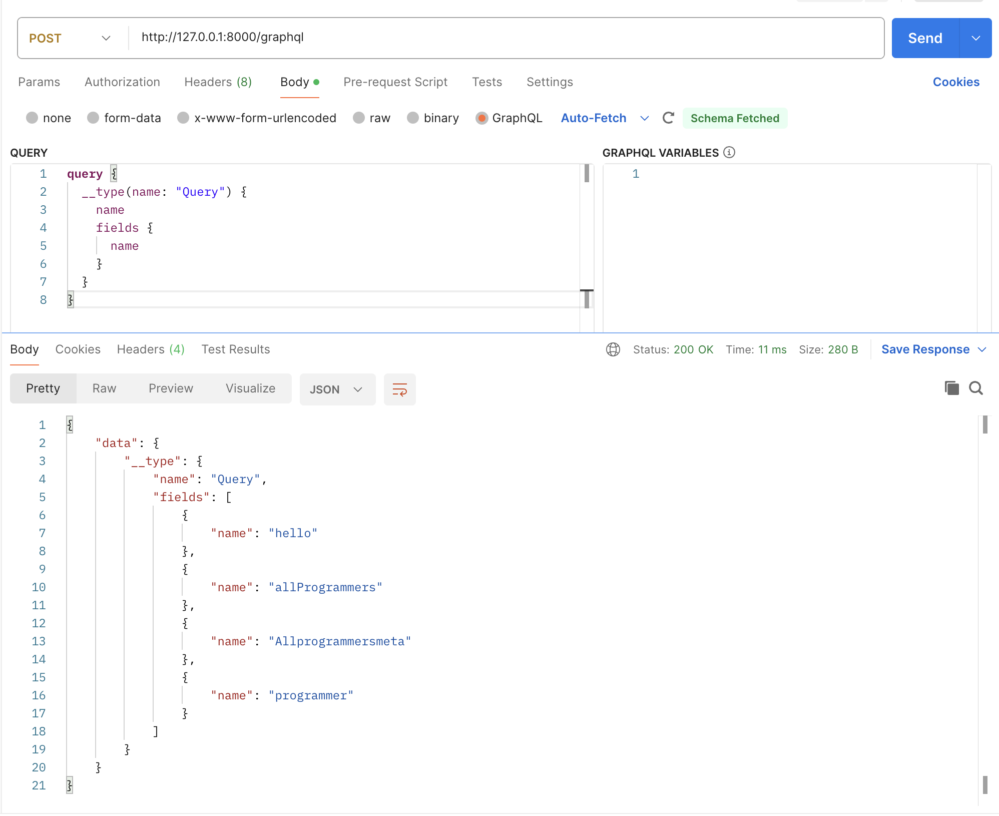

# react_adminのまとめ

## CORSエラー
http://localhost:3000（ReactAdmin）から http://localhost:8000（FastAPI）へのアクセスで以下のようなCORSエラーが発生した
```txt
Access to fetch at 'http://localhost:8000/graphql' from origin 'http://localhost:3000' has been blocked by CORS policy: No 'Access-Control-Allow-Origin' header is present on the requested resource. If an opaque response serves your needs, set the request's mode to 'no-cors' to fetch the resource with CORS disabled.
```
CORSを許可するため、以下のようなMiddlewareを実装
```python
app.add_middleware(
    CORSMiddleware,
    allow_origins=["http://localhost:3000"],  # CORSではhttp://localhost:3000のみ許可
    allow_methods=["POST"],  # CORSではPOSTのみ許可
)
```
allow_originsでlocalhost:3000からのアクセスを許可
allow_methodsでlocalhost:3000からのPOSTリクエストを許可

参考:
- https://developer.mozilla.org/ja/docs/Web/HTTP/CORS
- https://fastapi.tiangolo.com/ja/tutorial/cors/

## Cannot query field 'allProgrammers' on type 'Query'. エラー
ra-data-graphql-simple関数は特定のGraphQL文法で書かれたGraphQLサーバーに対して機能するため、query field に指定される `all〇〇` と `_all〇〇` を定義していない場合、以下のエラーが発生する

※以下のログで `app    |` となっているのはDockerで起動しているため
```shell
app    | Cannot query field 'allProgrammers' on type 'Query'. Did you mean 'programmers' or 'programmer'?
app    | 
app    | GraphQL request:2:3
app    | 1 | query allProgrammers {
app    | 2 |   items: allProgrammers {
app    |   |   ^
app    | 3 |     id
app    | Cannot query field '_allProgrammersMeta' on type 'Query'. Did you mean 'programmers'?
app    | 
app    | GraphQL request:12:3
app    | 11 |   }
app    | 12 |   total: _allProgrammersMeta {
app    |    |   ^
app    | 13 |     count
app    | INFO:     172.26.0.1:41782 - "POST /graphql HTTP/1.1" 200 OK
```
queryに合わせるため、以下のように  `all〇〇` と `_all〇〇` を定義する
```python
@strawberry.type
class Query:
    @strawberry.field
    async def allProgrammers(self) -> List[graphql_schemas.Programmer]:
        return await get_programmers()
    
    @strawberry.field
    async def _allProgrammersMeta(self) -> ListMetadata:
        return ListMetadata(count= len(await get_programmers()))
```

strawberryではfieldの定義にアンダースコアがあると、デフォルトではアンダースコアをキャメルケースに変換してしまう  
イントロスペクションを使って確認すると、以下のようにキャメルケースに変換されていることが確認できた




以下のように、`StrawberryConfig`を設定し、キャメルケースへの自動変換をOFFにする
```python
from strawberry.schema.config import StrawberryConfig
...
schema = strawberry.Schema(query=Query, mutation=Mutation, config=StrawberryConfig(auto_camel_case=False))
```

参考
- https://github.com/marmelab/react-admin/tree/master/packages/ra-data-graphql-simple#expected-graphql-schema
- https://graphql.org/learn/introspection/
- https://github.com/strawberry-graphql/strawberry/pull/798
